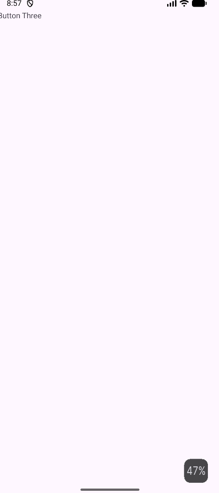

# Assignment 1 Submission
This assignment shows the ability to create a brand new empty view activity and implement
two new fragments (screens) to be able to display user functionality between 
input and displaying that pre-selected text.

## Application Screenshots
### First Fragment

### Second Fragment
